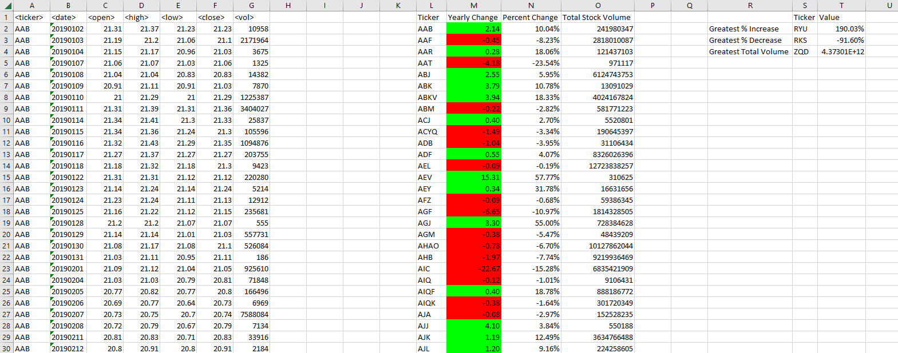
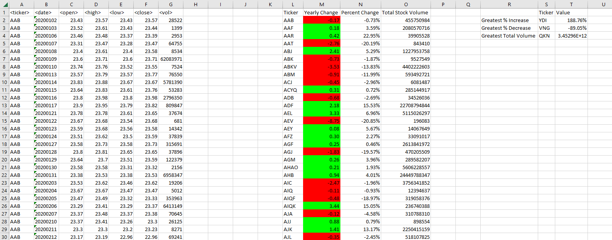

# VBA Homework: The VBA of Wall Street
## Summary
Attached is the script which generates below output which generates below metrics for each year :
- The ticker symbol
- Yearly change from the opening price at the beginning of a given year to the closing price at the end of that year.
- The percentage change from the opening price at the beginning of a given year to the closing price at the end of that year.
- The total stock volume of the stock.
- "Greatest % increase", "Greatest % decrease", and "Greatest total volume"

Observations
1. Ticker RKS has the greatest % decrease for two consecutive years ( 2018 and 2019)
2. Greatest total volume change was lower in 2018 compared to 2019 and 2020
3. Greatest % Decrease has been consistently been in the range of -89 to -92% in all three years

Year 2018

Year 2019

Year 2020

